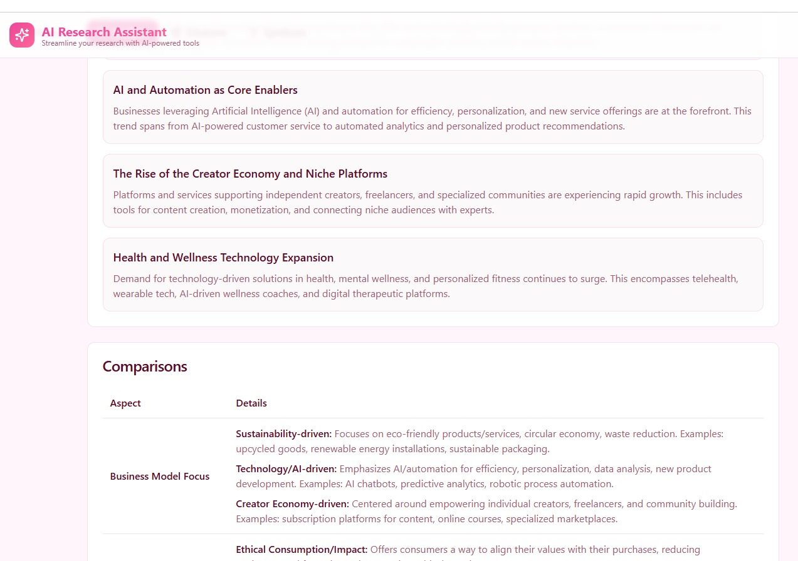

# AI Research Assistant

A web-based **AI-powered research tool** that helps users **plan, gather, and synthesize research** efficiently. Designed for students, professionals, and researchers, this project leverages multi-agent AI to produce comprehensive research reports with minimal manual effort.

## Features

- **Intelligent Research Planner**: Breaks down topics into key subtopics and research questions.
- **Automated Data Gathering**: Pulls information from multiple trusted sources in real-time.
- **Content Summarization**: Converts large volumes of research into concise, structured summaries.
- **Interactive Dashboard**: Visualizes research progress, sources, and insights.
- **Customizable Reports**: Generate professional, exportable research reports in PDF or Markdown.
- **User-Friendly Interface**: Intuitive UI requiring no coding experience.

## Demo link
https://topic-unraveler-pro.lovable.app

## Images

 





## How It Works

1. Enter your research topic in the web interface.  
2. AI agents break the topic into subtopics and collect data from reliable sources.  
3. The tool summarizes the findings into structured, easy-to-read content.  
4. Users can download the report or refine it with additional inputs.  

## Technologies Used

- **Frontend**: Vite, TypeScript, React, Tailwind CSS, shadcn-ui  
- **Backend**: Python, FastAPI  
- **AI & NLP**: Gemini AI, OpenAI GPT, LangChain  
- **Data Handling**: Pandas, NumPy  
- **Visualization**: Plotly, Matplotlib  
- **Deployment**: Vercel, Supabase  

## Setup Instructions

```bash
# Step 1: Clone the repository using the project's Git URL.
git clone https://github.com/kondurupriyanka/AI_Research_Assistant_Saas.git
 
# Step 2: Navigate to the project directory.
cd topic-unraveler-pro-main

# Step 3: Install frontend dependencies.
npm i

# Step 4: Start the development server with live reloading.
npm run dev

# Step 5: Configure environment variables.
# Replace .env.example with .env and add your keys
VITE_SUPABASE_PROJECT_ID=""
VITE_SUPABASE_PUBLISHABLE_KEY=""
VITE_SUPABASE_URL=""
GEMINI_AI_API_KEY=""
